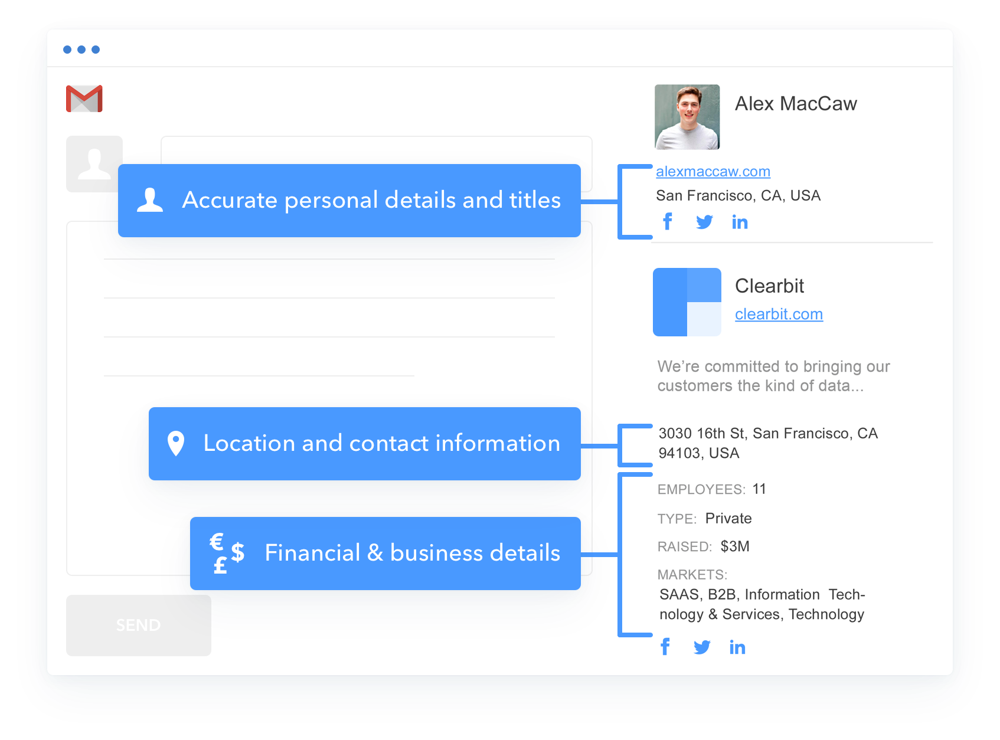

# Use Cases

One of the things that makes app marketplaces so powerful in so many different circumstances is that an app can be whatever you want it to be. As a marketplace owner, you can define what an app will mean within your ecosystem and how it will interact with your core product or platform.

## Key Distinctions

From a practical perspective, we like to distinguish between use cases based on two criteria. This enables us to understand how apps will benefit the end user, what technical requirements the ecosystem will have, and what developers will need to create apps.

### General vs specific

The first criterion is whether apps are general, like other standalone software, or specific to your core product or platform. Knowing this will help you decide how to best[ add apps](next.md#add-apps) to your marketplace and gauge what developers will need to create their own.

**Example:** [**Chrome Web Store**](https://chrome.google.com/webstore/category/extensions)****

.png>)

### Superficial vs deep

The second criterion is how deeply apps will interact with your core product or platform. For example, will they just connect your product/platform to one piece of external data, or will they add significant new functionality? Knowing this will also help you gauge what developers will need to create their own apps, as well as where the value-add will be for end users.

> **"The point is: as a platform, it’s not enough to just technically enable other software companies to integrate with your software, as just another application that they swap limited data with over APIs. That’s table stakes today."**
>
> _Scott Brinket_\
> _ThinkGrowth,_ [_Full Article_](https://thinkgrowth.org/how-to-build-a-saas-platform-3rd-party-developers-will-love-19c139ec8e72)__

## App Types

Here are some of the most common app types:

### Internal product features

[Internal product features](../getting-started/app-types.md#internal-product-features) are internal features within your core product or platform that can only be activated through the app marketplace.

**Example:** [**Product Reviews by Shopify on Shopify**](https://apps.shopify.com/product-reviews)

### Web integrations

[Web integrations](../getting-started/app-types.md#web-integrations) are apps which connect your core product or platform to third-party software and systems, usually by means of one or more APIs.

**Example:** [**Connect Google Drive to Slack**](https://slack.com/apps/A6NL8MJ6Q-google-drive)

### **Extensions/add-ons**

Extensions, also known as add-ons, are pieces of functionality complementary to your core product or platform.

**Example:** [**Clearbit Email Extension**](https://chrome.google.com/webstore/detail/clearbit-connect-supercha/pmnhcgfcafcnkbengdcanjablaabjplo?hl=en)****

### **Downloadable files**

[Downloadable files](../getting-started/app-types.md#downloadable-files) are any files (e.g. executable files or templates) which can be downloaded onto the end user's computer or server. They're often used to extend offline systems.

**Example:** [**Microsoft Store**](https://www.microsoft.com/en-us/store/apps/windows)

### **Web Plugins**

[Web plugins](../getting-started/app-types.md#web-plugins) are small, complementary pieces of functionality to your core product or platform that usually exist within the browser.

**Example:** [**Netlify Build Plugins**](https://www.netlify.com/products/build/plugins/)
****

### **Other Software**

Other kinds of software that can be distributed through an app marketplace include:

* [Containers and charts](../getting-started/app-types.md#containers-and-charts)
* [VM images](../getting-started/app-types.md#virtual-machine-images)
* [Mobile apps](../getting-started/app-types.md#mobile-apps)

### **App or Partner Listings**

App marketplaces can also have listings that promote partners and their apps. In these cases, the call-to-action usually involves filling out a contact form or navigating to the partner's website. This is especially popular in highly regulated industries, where the cost of third party services is often much higher (e.g. 5-6 figures per year).

Example: [**Workday Marketplace**](https://marketplace.workday.com)
