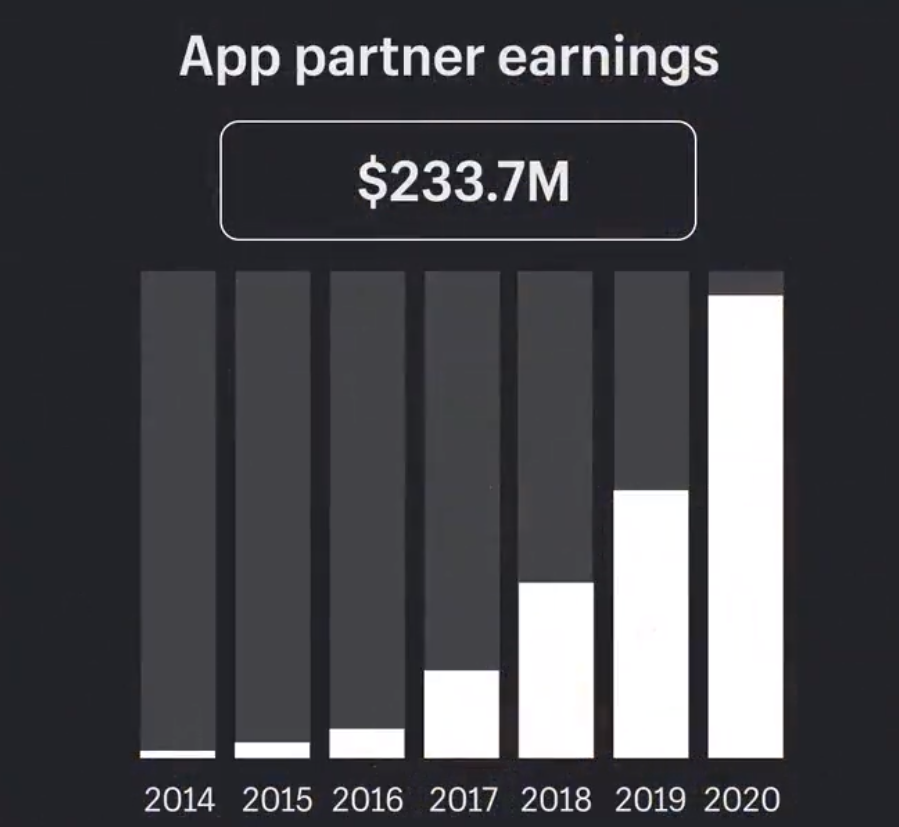

# Common Goals

When building an app marketplace, companies often have more than one goal. In this section, we'll describe some of the most common goals:

* Expanding product functionality
* Revenue growth
* Meeting industry expectations
* Differentiation&#x20;

## 1. Expanding P**roduct Functionality**

As more and more apps are created, an app marketplace can significantly expand the functionality of your core product, and as a result, the users and experiences it can support.

Apps can enable **integration**, connecting your product to third-party software and systems, and/or introduce new **standalone functionality**.

In either case, new product functionality can in turn benefit your business in two different ways.

### Improved User Experience

It's safe to say that offering greater functionality, especially when users can choose what features they do and don't want, leads to a richer user experience.

Of course, the better the user experience, the more likely users are to hang around – thus improving both customer retention and lifetime value.

Amazingly, [Salesforce](https://appexchange.salesforce.com/mktcollections/curated/whatisappexchange) reports that 86% of their customers have installed an app, demonstrating the value of apps to end users:

### Wider Customer Base

Aside from improving the user experience for existing customers, offering greater functionality also makes your product more attractive to a wider audience of potential customers. This should ultimately lead to more customers and higher revenues.

## **2. Revenue Growth**

An app marketplace can be a powerful asset for revenue generation, both indirect and direct.

### Indirect

Indirectly, app marketplaces can drive additional revenue by increasing customer retention and lifetime value, as well as by adding new users, as outlined in the previous section.

> **"We know the lifetime value of any customer that uses one or more third party apps increases by a very significant amount."**
>
> _Alex Barnett_\
> _Director of Developer and Partner Platforms at Intuit_


Read the full interview and case study [here](https://openchannel.io/blog/app-ecosystem-alex-barnett-intuit/).


### Direct

Directly, app marketplaces can drive revenue through several different models. Perhaps the most popular revenue generation model for app marketplaces is **** [revenue sharing](../success/monetization.md#revenue-sharing), whereby the platform owner receives a commission on all paid app sales.

Other models include [developer membership](../success/monetization.md#developer-membership), where third-party developers pay a fee to list apps on the marketplace, and [sponsored apps](../success/monetization.md#sponsored-apps), where third-party developers pay to promote apps on the marketplace.

**Case Study:** [**Shopify**](https://apps.shopify.com)****

A great example of successful marketplace monetization is the Shopify App Store. In 2020, they paid $233.7M to partners through revenue sharing (and generated corresponding revenue for themselves), with earnings continuing to grow year-on-year:

## **3. Meeting Industry Expectations**

In some industries, app marketplaces are slowly becoming an expectation. If this is the case, launching your own marketplace may be an important way to keep up with competitors and continue meeting customer needs.

**Example: Point of Sale Industry**

* **​**[**Clover App Market**](https://www.clover.com/appmarket)**​**
* **​**[**Square App Marketplace**](https://squareup.com/ca/en/app-marketplace)**​**
* [**Shopify POS Apps**](https://apps.shopify.com/collections/shopify-pos-apps)
* **​**[**Lightspeed App Store**](https://www.lightspeedhq.com/ecommerce/store/apps/)**​**
* **​**[**Vend Apps**](https://www.vendhq.com/tour/pos-integrations-apps)**​**
* [**Toast Integrations**](https://pos.toasttab.com/integrations)

## **4. Differentiation**

Last but not least, in some industries, an app marketplace may be an effective way to differentiate yourself from the competition. Ultimately, this may be the difference over which a user chooses you instead of a competitor.

**Example:**[ **Citibank**](https://www.borndigital.com/2020/12/21/citis-new-fintech-marketplace-features-expensify-xero)

In an industry of high regulation (and somewhat lagging user experiences), Citibank has been one of the first US banks to develop an app marketplace with partner-facing APIs, ultimately enabling a more connected banking experience for customers.\
