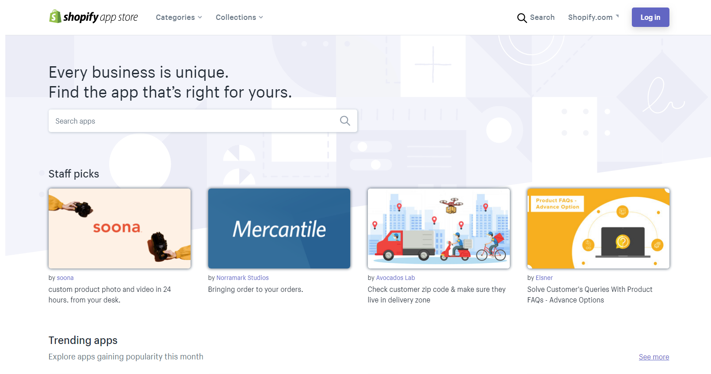

# App Marketplaces

_Read first:_ [_Key Terms_](https://blueprint.openchannel.io/getting-started/key-terms) _| Read next:_ [_App Types_](https://blueprint.openchannel.io/getting-started/app-types/)__

App marketplaces are a proven way for digital platforms to extend the functionality of their offerings, create new revenue streams, and build an ecosystem of developers and partners around their product. On this page, we'll discuss:

* What Is an App Marketplace?
* Make-up of a Marketplace

## What Is an App Marketplace?

An app marketplace, also known as an app store, app directory, add-on or extension marketplace (or even a few other variations!) is a structure that enables third parties to build and distribute add-ons for a platform's products. These add-ons, or [_apps_](http://blueprint.openchannel.io/getting-started/app-types/), can be anything from free integrations with another organization's products, to premium platform-specific functionality.

Successful app marketplaces include the [Salesforce AppExchange](https://appexchange.salesforce.com), [Atlassian Marketplace](https://marketplace.atlassian.com), and [Shopify App Store](https://apps.shopify.com), achieving respective annual revenues of $1.5 billion ([2016](https://www.vox.com/2016/1/14/11588810/salesforce-coms-appexchange-is-10-years-old-today#:\~:text=While%20some%20apps%20are%20free,the%20fiscal%20year%20just%20ended.)), $200 million ([2018](https://openchannel.io/blog/atlassian-marketplace-building-your-ecosystem/)), and at least $100 million ([2018](https://developers.shopify.com)). They can also see huge growth and adoption, like the HubSpot Ecosystem, which is expected to generate $12.5 billion in [revenue by 2024](https://ir.hubspot.com/news/new-industry-white-paper-shows-the-hubspot-ecosystem-is-uniquely-positioned-to-help-scaling-companies-adapt-to-digital-first-world).


To see more examples of successful app marketplaces, check out this [list of 50 leading app marketplaces](https://docs.google.com/spreadsheets/d/1-wMQWNpgOmTqr2QuUBb7EjvttWROZJIRvIvJAysyvTQ/edit#gid=0) created by [Clement Vouillon](https://twitter.com/clemnt).


### Benefits

App marketplaces have benefits for all parties involved: the platform itself, its end customers, and those who create apps — the _partners and developers_.

For the platform, an app marketplace offers fast-paced, hands-free product innovation and integration. Of course, there is work involved in setting up and managing a marketplace. Once operational, however, partners take charge in independently building and maintaining additional product functionalities in the form of apps. App marketplaces can also lead to new [revenue streams](http://blueprint.openchannel.io/success/monetization/), with shared revenue on paid apps or partner sponsorships.

For end customers, an established marketplace can drastically improve the platform experience. Apps are a direct extension to the value proposition of a product they already use. Even paid apps improve the consumer's experience, as the issue of pricing is often far outweighed by the merit of purpose-specific functionalities and integrations for an existing solution.

For partners, the benefits of contributing to an app marketplace include exposure, distribution, and direct revenue generation. Publishing an app to a marketplace makes it discoverable by thousands of targeted users (exposure), who are also provided a convenient way to activate it (distribution). Whether the marketplace offers integrated [monetization](http://blueprint.openchannel.io/success/monetization/) or the partner charges for their app externally, direct revenue is perhaps the most exciting prospect for many partners.

## Make-up of a Marketplace

An app marketplace consists of several essential parts, including both the frontend interface that customers use and the required backend functionality

### The Marketplace Itself

The major public-facing component of an app marketplace is the marketplace itself, where apps are listed. Its purpose is to enable consumers to discover, research, and install apps. The marketplace consists of a [homepage](http://blueprint.openchannel.io/marketplace/homepage/), [category and search results pages](https://blueprint.openchannel.io/marketplace/search-categorization/), as well as individual [app details pages](http://blueprint.openchannel.io/marketplace/app-pages/).

Depending on the decisions of both the platform and app partner, functional interactions with an app that occur post-installation can happen in multiple ways (that we’ll cover in later guides). Items like app [versioning](http://blueprint.openchannel.io/management/updates/) and [invoicing](http://blueprint.openchannel.io/operations/invoicing/) can also be handled in a variety of ways depending on the core platform needs.

_The homepage for the Shopify App Store._

### Developer Dashboard

A crucial partner-facing element of an app marketplace is the developer dashboard. This interface enables developers to [submit](http://blueprint.openchannel.io/management/submission/) and track the status of new apps, as well as manage existing apps. This includes editing app listings and rolling out [updates](https://blueprint.openchannel.io/management/updates/), as well as monitoring listing traffic, app sales, and feedback.

_The developer dashboard on OpenChannel's demo marketplace._

### Administrator Dashboard

An app marketplace also includes an admin dashboard, where the platform owner can manage app listings and monitor the [performance](http://blueprint.openchannel.io/success/metrics/) of the marketplace. Additionally, the admin dashboard provides marketplace administrators access to billing and support workflows. Smaller marketplaces may assign a single administrator to handle new app submissions within the admin dashboard, while larger marketplaces often create more complex [review flows](http://blueprint.openchannel.io/management/review/) that require multiple teams.

_The administrator dashboard on OpenChannel's demo marketplace._

## What's Next?

We've looked at what an app marketplace is and what it includes, in practical terms. On the next page — [App Types](https://blueprint.openchannel.io/getting-started/app-types/) — we'll see what an "app" really is at the software level.
