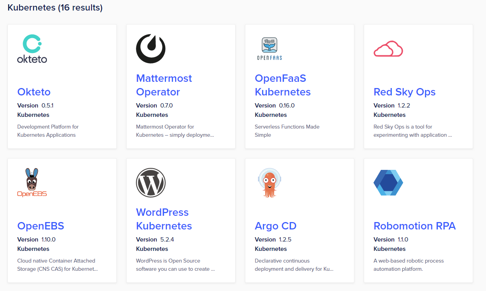

# App Types

_Read first:_ [_App Marketplaces_](https://blueprint.openchannel.io/getting-started/app-marketplaces) _| Read next:_ [_Homepage_](http://blueprint.openchannel.io/marketplace/homepage/)__

An app can be _any_ piece of functionality that complements a product or platform. Depending on how it does so, it usually falls under one of several common app types:

* Internal Product Features
* Web Integrations
* Downloadable Files
* Containers and Charts
* Other Types

## Internal Product Features

An internal product feature is an app built and maintained by the platform owner that is complementary to the core product or platform. These features are distributed as apps (instead of being included natively) to simplify the core product or platform and prevent feature creep.

.png>)

_This app on the_ [_Shopify App Store_](https://apps.shopify.com/partners/shopify) _is built and maintained by Shopify itself. This functionality could be included in the default Shopify user interface, but it is distributed as an app instead._

Internal product features often appear alongside other app types in app marketplaces. This way, users can find, activate, and manage both internal and external apps in a single place.

It is possible to create an app marketplace that focuses on distributing only internal product features. While this is a valuable strategy for managing product complexity, it means doing away with the third-party innovation that makes app marketplaces so valuable.

## Web Integrations

A [web integration](https://openchannel.io/solutions/web-integrations/) is an app that interacts with a product or platform through a set of APIs. The integration itself, which is hosted by the app developer, can request data from and make changes on the platform using the API. With webhooks, the integration can also ask to be notified when an event takes place so that it can perform certain actions.

.png>)

_Most apps on SaaS platforms, like this app on the_ [_Zendesk Marketplace_](https://www.zendesk.com/apps/)_, fall under the category of web integrations._

SaaS companies often use web integrations to link their platforms together, giving users a more connected digital experience. Users can grant permission for these integrations to access their account on a session-by-session or app-by-app basis, often using an [OAuth flow](http://blueprint.openchannel.io/operations/oauth-activation/).

## Downloadable Files

A [downloadable file](https://openchannel.io/solutions/downloadable-files/) is an app that is downloaded and installed onto a local device. It can be any file type, such as ZIP, RPM, or XLS, depending on how it interacts with the product.

.png>)

_The_ [_Microsoft Store_](https://www.microsoft.com/en-us/store/apps/) _is the best known example of an app marketplace that distributes downloadable files._

Downloadable files are commonly used to add functionality to on-premises computer systems, personal computers, and other hardware devices.

## Containers and Charts

A [container or chart](https://openchannel.io/solutions/containers-and-charts/) is an app that has been packaged together with any dependencies using a tool like Docker, Helm, or CoreOS.

_On the_ [_DigitalOcean Marketplace_](https://marketplace.digitalocean.com)_, you can instantly deploy Kubernetes (container) based apps._

Containers and charts are used to deploy functionality to dedicated or on-premises hardware. In particular, they are often used by Infrastructure as a Service (IaaS) or Platform as a Service (PaaS) companies to enable new backend functionality on their servers.

Containers and charts can be signed, giving users the confidence that the app they are installing has not been tampered with.

## Other Types

As mentioned earlier, an app can be _any_ piece of functionality that complements your product or platform. If there are other pieces of functionality that complement your product or platform, they too can be called apps and distributed through an app marketplace. Below are some of the less common app types.

### Virtual Machine Images

Functioning like a template, a virtual machine image (like a Droplet, VDI, or AMIs) can be used to spin up a virtual machine instance and enable new backend functionality.

_Example: Amazon Machine Images on_ [_AWS Marketplace_](https://aws.amazon.com/marketplace)

### Web Plugins

A web plugin is an app that usually adds to or integrates with a product or platform's web interface. It does so using web technologies like Web Components, HTML, or Javascript.

_Example: Plugins on_ [_Figma_](https://www.figma.com/community) [_Community_](https://www.figma.com/community)


For more information on web plugins, see [this blog post](https://www.figma.com/blog/how-we-built-the-figma-plugin-system/) from Figma.


### Mobile Apps

A mobile app is a file that is downloaded and installed onto a mobile device. For Android, mobile apps use the APK format. For Apple’s iOS, they use the IPA format and can only be distributed through the Apple App Store or iTunes.

_Example: Apps on_ [_Google Play Store_](https://play.google.com/store?hl=en)

## What's Next?

From web integrations to containers, we've looked at the most popular app types. In the upcoming sections, we'll talk about the anatomy of the app marketplace itself, starting with the [Homepage](http://blueprint.openchannel.io/marketplace/homepage/).
